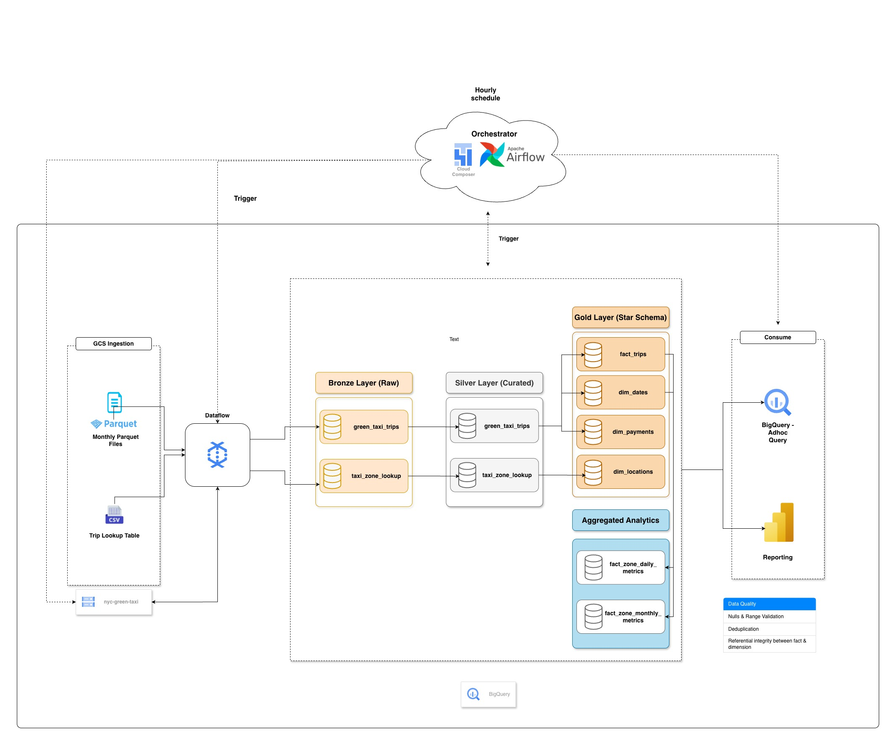

# NYC-Green-Taxi-Data-Lakehouse
Modern data platform processing NYC taxi trips from GCS to BigQuery using Airflow and Dataflow. Covers raw ingestion, transformations, dimensional modeling, and analytics tables with scalable, modular design.

## Project Overview
- **Source:** Raw Parquet files arrive hourly in GCS in a **time-partitioned format**:
```bash
gs://nyc-green-taxi-raw/2026/02/10/14/*.parquet
```
- **Pipeline Orchestration:** Airflow DAGs run hourly to check for new files. If files are present, the DAG triggers a **Dataflow (Apache Beam)** pipeline to parse and load the data.
- Data Lakehouse Architecture:
    - **Bronze Layer:** Raw data is loaded from GCS into BigQuery with minimal transformation.
    - **Silver Layer:** Cleaned and transformed data; supports incremental loads to optimize cost and avoid scanning the entire table.
    - **Gold Layer:** Analytics-ready tables aggregated for business use cases; also supports incremental updates.
- **Incremental Loads:** Implemented in silver and gold layers to reduce BigQuery costs and improve performance by processing only new or updated records.

## Architecture Diagram




## Project Structure
```bash


NYC-Green-Taxi-Data-Lakehouse/
├── Dockerfile
├── LICENSE
├── README.md
├── beam/
│   └── ny_taxi_green_ingestion.py
├── config/
│   └── airflow.cfg
├── dags/
│   ├── config/
│   │   └── pipeline_config.yaml
│   └── nyc_green_taxi_lakehouse_pipeline.py
├── data/
│   └── README.md
├── docker-compose.yaml
├── docs/
├── logs/
├── plugins/
├── sql/
│   ├── bronze/
│   │   └── ddl_nyc_green_taxi_bronze_silver.sql
│   ├── gold/
│   │   ├── ddl_gold_analytics_tables.sql
│   │   ├── dim_dates.sql
│   │   ├── dim_locations.sql
│   │   ├── dim_payments.sql
│   │   ├── fact_trips.sql
│   │   ├── fact_zone_daily_metrics.sql
│   │   └── fact_zone_monthly_metrics.sql
│   ├── init_nyc_taxi_datasets.sql
│   └── silver/
│       ├── ddl_silver_green_taxi_tables.sql
│       ├── load_taxi_zone_lookup_bronze_to_silver.sql
│       └── merge_green_tripdata_bronze_to_silver.sql
└── tests/
    ├── bronze/
    │   └── data_quality_check.sql
    ├── gold/
    │   └── data_quality_checks.sql
    └── silver/
        └── data_quality_checks.sql

```

## How It Works
1. File Arrival in GCS
    - Files are uploaded hourly in a time-partitioned folder structure.
2. Airflow DAG Execution
    - Runs every hour to check for new files.
    - If files are present, it triggers the Dataflow pipeline.
3. Dataflow Pipeline (Beam)
    - Parses raw Parquet files.
    - Loads data into bronze tables in BigQuery.
4. Silver Layer
    - Applies cleaning, deduplication, and transformation logic.
    - Supports incremental load to reduce scanning costs.
5. Gold Layer
    - Aggregates and models data for analytics use cases.
    - Also incremental, ensuring cost-effective updates.

## Technologies Used
- Apache Airflow – Orchestration of hourly DAGs
- Apache Beam / Google Dataflow – Scalable ETL pipelines
- Google Cloud Storage (GCS) – Raw data landing zone
- BigQuery – Data warehouse for bronze, silver, gold tables
- Docker / Docker Compose – Local development and testing
- SQL – Table creation, transformation, and aggregation logic
