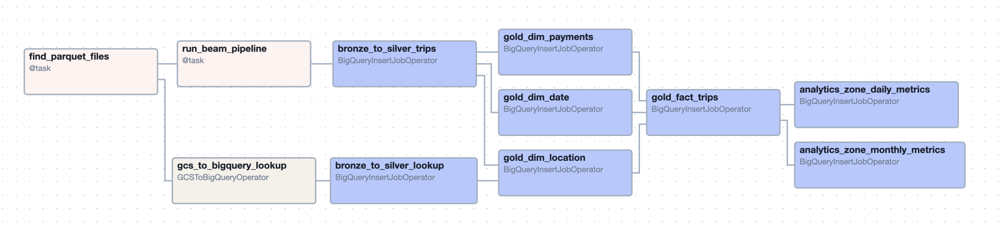

# NYC-Green-Taxi-Data-Lakehouse
End-to-end batch data platform built on Google Cloud using GCS → Dataflow → BigQuery → Airflow following the Medallion Architecture (Bronze / Silver / Gold).

This project demonstrates production-style ingestion, incremental processing, dimensional modeling, and analytics-ready serving.

## Project Goals
- Build a scalable & cost-efficient batch pipeline
- Process data by time partitions
- Maintain idempotent incremental loads
- Apply data quality & transformations
- Deliver analytics-ready star schema
- Orchestrate everything with Airflow

## Technologies Used
| **Area**         | **Technology / Tool**              |
|------------------|----------------------------------|
| Storage          | Google Cloud Storage              |
| Processing       | Apache Beam / Dataflow            |
| Warehouse        | BigQuery                          |
| Orchestration    | Apache Airflow                    |
| SQL              | BigQuery Standard SQL             |
| Config           | YAML                              |

## Architecture Diagram


## Bronze Layer – Raw

**Purpose:** Immutable ingestion from source.

**Tables**
- green_tripdata
- taxi_zone_lookup

**Characteristics**

- Append-only
- Minimal transformation
- Includes ingestion metadata
- Supports replay

## Silver Layer – Clean & Standardized

**Purpose:** Business-ready cleaned data.

**Transformations**
- Data type standardization
- Code → description mapping
- Invalid & negative handling
- Deduplication
- Incremental MERGE using ingestion_ts

## Gold Layer – Star Schema

**Purpose:** Optimized for analytics & BI.

**Dimensions**
- dim_dates
- dim_locations
- dim_payments

**Facts**
- fact_trips

**Aggregations**
- fact_zone_daily_metrics
- fact_zone_monthly_metrics

## Incremental Strategy

Airflow processes data per time window.

Dataflow loads that window → BigQuery MERGE ensures:
- latest version per key
- safe reprocessing
- no duplicates

##  Orchestration Flow
- Airflow detects partition
- Run Dataflow → Bronze
- Bronze → Silver MERGE
- Build Dimensions
- Build Fact
- Build Aggregates

**DAG Diagram:**


## Project Structure
```bash


NYC-Green-Taxi-Data-Lakehouse/
├── Dockerfile
├── LICENSE
├── README.md
├── beam/
│   └── ny_taxi_green_ingestion.py
├── config/
│   └── airflow.cfg
├── dags/
│   ├── config/
│   │   └── pipeline_config.yaml
│   └── nyc_green_taxi_lakehouse_pipeline.py
├── data/
│   └── README.md
├── docker-compose.yaml
├── docs/
├── logs/
├── plugins/
├── sql/
│   ├── bronze/
│   │   └── ddl_nyc_green_taxi_bronze_silver.sql
│   ├── gold/
│   │   ├── ddl_gold_analytics_tables.sql
│   │   ├── dim_dates.sql
│   │   ├── dim_locations.sql
│   │   ├── dim_payments.sql
│   │   ├── fact_trips.sql
│   │   ├── fact_zone_daily_metrics.sql
│   │   └── fact_zone_monthly_metrics.sql
│   ├── init_nyc_taxi_datasets.sql
│   └── silver/
│       ├── ddl_silver_green_taxi_tables.sql
│       ├── load_taxi_zone_lookup_bronze_to_silver.sql
│       └── merge_green_tripdata_bronze_to_silver.sql
└── tests/
    ├── bronze/
    │   └── data_quality_check.sql
    ├── gold/
    │   └── data_quality_checks.sql
    └── silver/
        └── data_quality_checks.sql

```

## How It Works
1. File Arrival in GCS
    - Files are uploaded hourly in a time-partitioned folder structure.
2. Airflow DAG Execution
    - Runs every hour to check for new files.
    - If files are present, it triggers the Dataflow pipeline.
3. Dataflow Pipeline (Beam)
    - Parses raw Parquet files.
    - Loads data into bronze tables in BigQuery.
4. Silver Layer
    - Applies cleaning, deduplication, and transformation logic.
    - Supports incremental load to reduce scanning costs.
5. Gold Layer
    - Aggregates and models data for analytics use cases.
    - Also incremental, ensuring cost-effective updates.
 
 
## Data Quality & Testing

**Bronze**
- Schema validation
- Null checks
- Type checks

**Silver**
- PK uniqueness (trip_id)
- Valid timestamps
- Positive distance/fare

**Gold**
- FK integrity
- No orphan keys
- Aggregation correctness


